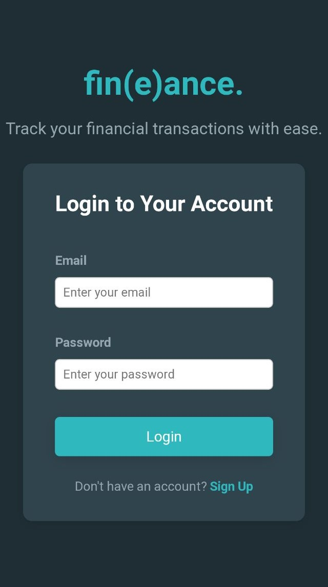
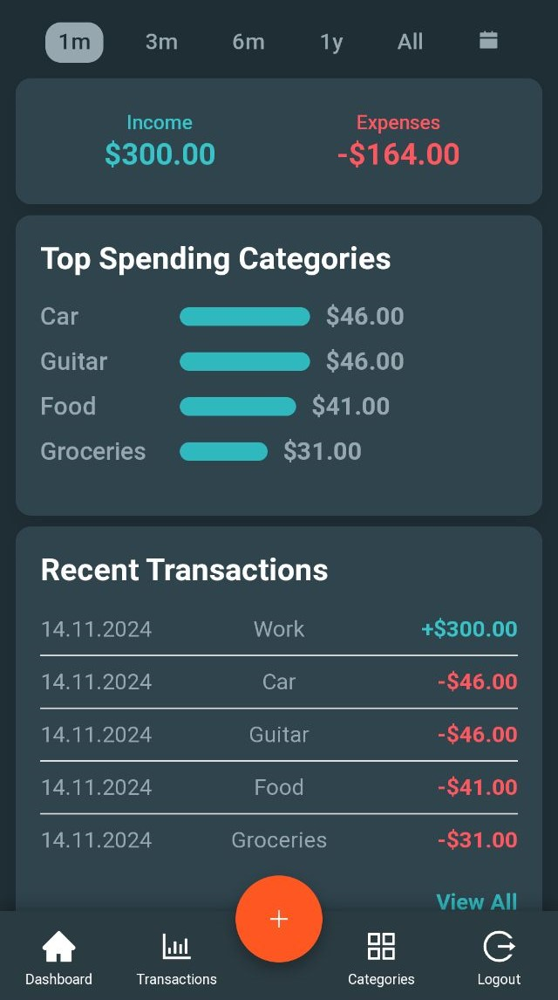
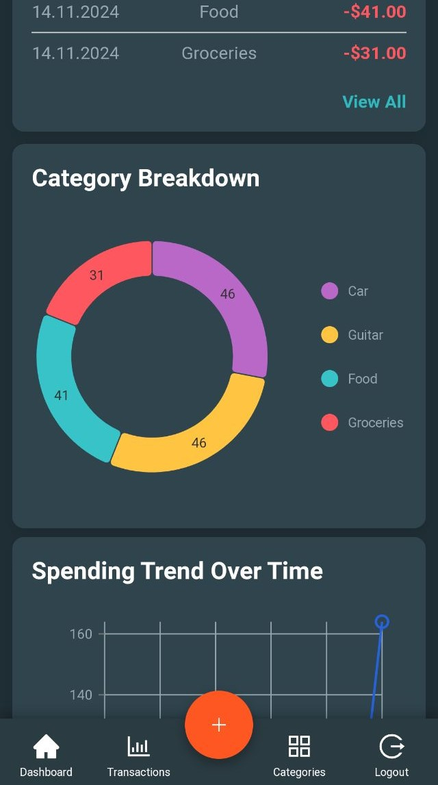

# fin(e)ance.
A financial dashboard PWA (Progressive Web App) built on the MERN Stack:
- MongoDB
- Express
- React
- Node.js
  
with:
- modern CSS styling
- continuous integration (CI) with automated testing using GitHub Actions
- continuous deployment (CD) on Render (backend) and Vercel (frontend)
- and much more...

  
  
  

  
# Installation
Usable on desktop and mobile, though the layout is currently more polished on mobile. Just visit: https://fin-e-ance-simon-gns-projects.vercel.app/ and sign up. You can also install the app on mobile by visiting the URL and selecting "Add to Home screen" in the browser’s "three-dot" menu. Your browser might also prompt you to install the app upon visiting the URL.

# TODO:
There are many more "nice-to-have" features I’d like to implement, and some current features could definitely be improved to some extent. However, this project was primarily intended as a learning project to improve my skills as a full-stack developer, so those implementations and improvements will have to wait. That said, improvements to the CSS styling and layout will be coming in the near future.
