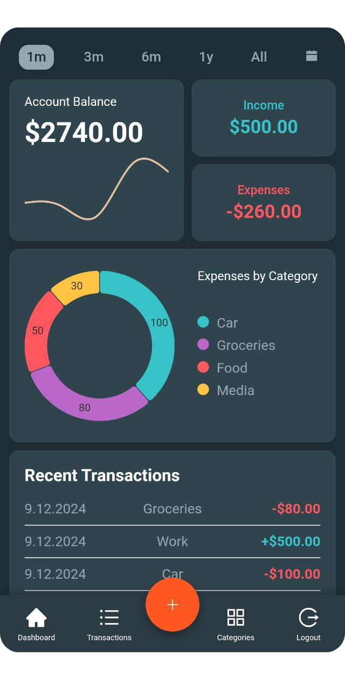

# fin(e)ance.
A financial dashboard PWA (Progressive Web App) built on the MERN Stack:
- MongoDB
- Express
- React
- Node.js
  
with:
- modern CSS styling
- continuous integration (CI) with automated testing using GitHub Actions
- continuous deployment (CD) on Render (backend) and Vercel (frontend)
- and much more...

&nbsp;

  
  &nbsp; &nbsp; &nbsp; &nbsp;
  
  &nbsp; &nbsp; &nbsp; &nbsp;
  

  
# Installation
Usable on desktop and mobile, although the layout currently is more polished on mobile. Just visit: https://fin-e-ance-simon-gns-projects.vercel.app/ and sign up. You can also install the app on mobile by visiting the URL and selecting "Add to Home screen" in the browser’s "three-dot" menu. Your browser might also prompt you to install the app upon visiting the URL.

## Known Issues
Since the server is deployed on a free instance, it goes idle after periods of inactivity. When accessed for the first time after being idle, the server needs to "wake up," which can delay requests by 50 seconds or more.

# To-do
There are many more "nice-to-have" features I’d like to implement, and some current features require further refinement. Additionally, the test coverage needs to be expanded, especially with more integration tests and possibly some end-to-end tests. Moreover, the CSS styling and layout have not been thoroughly tested across various devices and operating systems, leading to layout distortions in certain areas, especially on iPhones.

However, this project was primarily intended as a learning experience to enhance my skills as a full-stack developer, so some of these features and improvements will be deferred for now. That said, updates to the CSS styling and layout, along with expanded test coverage, are planned for the near future.
